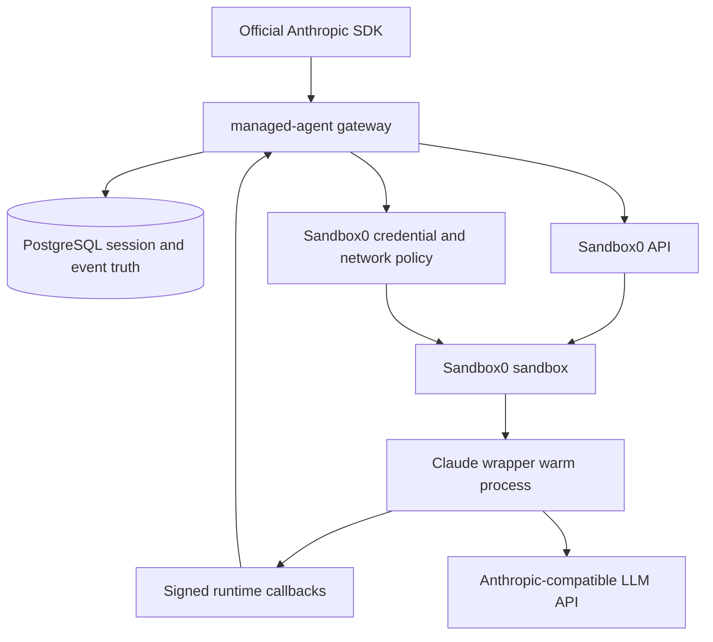

# Managed Agents

Sandbox0 Managed Agents is a backend implementation for Claude Managed Agents-style workflows. You use the official Anthropic SDK, but point the SDK at a Sandbox0 Managed Agents API endpoint instead of Anthropic's hosted Managed Agents endpoint.

Sandbox0 provides the backend pieces behind the API: session truth, event history, runtime orchestration, Sandbox0 sandboxes, persistent volumes, network policy, and credential injection boundaries.

<Callout variant="info">
Sandbox0 does not provide a separate Managed Agents SDK. Use the official Anthropic SDK or the HTTP API shape generated from the official Managed Agents contract.
</Callout>

## What It Is

Managed Agents sit one layer above raw sandboxes. A normal sandbox gives you process execution, files, volumes, networking, and webhooks. A managed agent adds a durable agent session model around those primitives.

| Object | Role |
|--------|------|
| Agent | Versioned model, system prompt, tools, MCP servers, and custom skills |
| Environment | Container-like runtime configuration: packages and network mode |
| Session | Durable unit of agent work, attached to one environment and agent snapshot |
| Events | Append-only history for user messages, agent output, tool use, status, and errors |
| Vaults | Session-scoped credentials for the LLM and external MCP services |
| Resources | Files and GitHub repositories mounted into the session workspace |

## Architecture

The key boundary is that session truth lives outside the sandbox. The sandbox is the execution attachment for a session, not the source of truth for the session.

## Request Flow

1. Create an `agent` and an `environment` through the Managed Agents API.
2. Create a session that references the agent and environment.
3. Attach an LLM vault and optional resource or MCP vaults.
4. Send `user.message` events.
5. The backend claims or resumes a Sandbox0 runtime, mounts volumes, syncs resources, applies network policy, and starts the wrapper run.
6. The wrapper emits signed callbacks. The gateway appends those events to the session log.
7. The client lists or streams events until the session becomes idle, requires action, terminates, or is deleted.

## Why It Uses Sandbox0

Managed agent workloads need more than a chat loop. They need a workspace that can survive across turns, tool calls that run in an isolated runtime, and a credential boundary that does not assume generated code should see every token.

Sandbox0 maps naturally to those requirements:

| Managed Agents need | Sandbox0 primitive |
|---------------------|--------------------|
| Runtime execution | Sandbox and `procd` |
| Workspace state | SandboxVolume mounts |
| Fast startup | Template warm pool |
| Agent-side service | Template warm process |
| Event callback | Sandbox webhooks |
| Network control | `SandboxNetworkPolicy` and `netd` |
| Secret-safe outbound access | Credential sources and egress auth |

## API Host vs LLM Host

Keep these two endpoints separate:

| Endpoint | Meaning |
|----------|---------|
| Managed Agents API host | The Sandbox0 endpoint the official SDK calls, for example `https://agents.sandbox0.ai` |
| LLM host | The Anthropic-compatible model endpoint used by the wrapper, configured through an LLM vault |

Your SDK client uses a Sandbox0 API key. Your Anthropic or Anthropic-compatible model token goes in an LLM vault.

## Next Steps

<CardGrid>
  <LinkCard
    title="Claude SDK"
    href="/docs/managed-agents/claude-sdk"
    cta="Connect"
  >
    Point the official Anthropic SDK at Sandbox0 Managed Agents
  </LinkCard>

  <LinkCard
    title="LLM Credentials"
    href="/docs/managed-agents/llm-credentials"
    cta="Configure"
  >
    Store model host and token in a Sandbox0 managed vault
  </LinkCard>

  <LinkCard
    title="Compatibility"
    href="/docs/managed-agents/compatibility"
    cta="Compare"
  >
    Understand the current API surface and Sandbox0-specific behavior
  </LinkCard>
</CardGrid>
